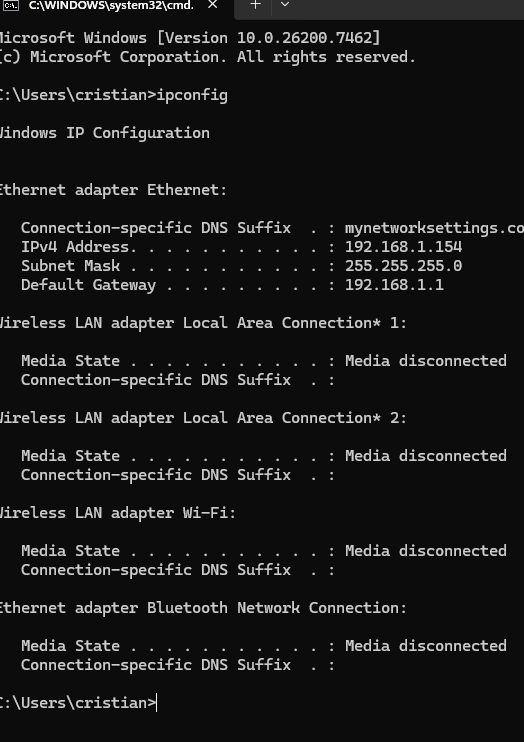
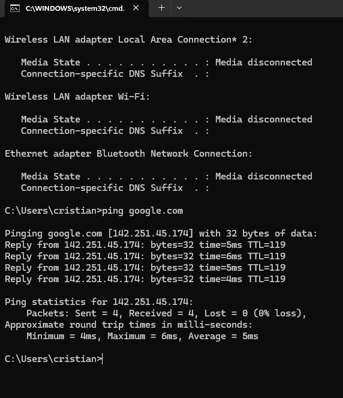

# 🌐 Network Troubleshooting Lab

## 📌 Overview
This project demonstrates hands-on network diagnostics using Windows Command Prompt tools.  
The goal is to show the ability to identify connectivity issues, analyze DNS behavior, test routing paths, and verify local IP configuration.

---

## 🛠️ Commands Demonstrated

### ✔️ 1. `ipconfig` — Check Local IP Configuration
Used to retrieve IP address, subnet mask, and default gateway.

📸 **Screenshot:**  

---

### ✔️ 2. `ping google.com` — Test Connectivity
Used to verify connectivity to an external host and measure latency.

📸 **Screenshot:**  

**What we learn from this:**  
- Host is reachable  
- Response times are healthy  
- No packet loss  

---

### ✔️ 3. `tracert google.com` — Trace Network Route
Shows each hop between the local computer and Google's servers.

📸 **Screenshot:**  

**What we learn from this:**  
- Local router at 192.168.1.1  
- ISP routing hops  
- One hop times out (normal on some networks)  
- Path successfully reaches Google  

---

### ✔️ 4. `nslookup google.com` — DNS Lookup
Used to identify DNS servers and resolve domain names to IP addresses.

📸 **Screenshot:**  

**What we learn from this:**  
- Shows local DNS resolver  
- Resolves Google’s IPv4 and IPv6 addresses  
- Confirms DNS is functioning correctly  

---

## 📝 Troubleshooting Summary

| Command | Purpose | Result |
|---------|----------|---------|
| `ipconfig` | Check local network configuration | Valid IP & gateway |
| `ping` | Test connectivity & latency | Successful replies |
| `tracert` | Trace route across network | Reaches Google |
| `nslookup` | Test DNS resolution | DNS resolving normally |

---

## 🧠 Lessons Learned
- How DNS resolution works  
- How routing paths differ across networks  
- How to test latency and connectivity  
- How local IP configuration affects network access  
- Why traceroute may show “timeouts” on protected hops  

---

## 📚 Tools Used
- Windows Command Prompt  
- ISP DNS Resolver  
- Local Router  

---

## ✅ Status
✔️ Completed  
✔️ Screenshots included  
✔️ Recruiter-ready  
